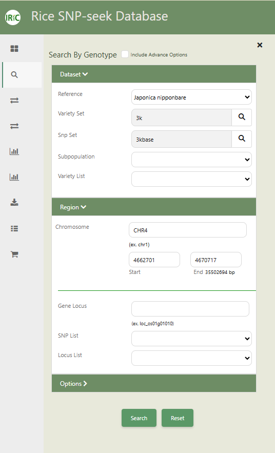

# Search Genotypes

> Note that our QTL/trait of interest is in this region:
> **<u>Chr4:4662701-4670717</u>**
>
> You can begin by searching for SNPS that lie within this region using
> the 3k rice dataset. There are 4 SNP Sets available:

- **<u>3K All</u>:** 32 million full 3K RG SNPs Dataset

> This SNP Set contains the full set of 32 million biallelic &
> multiallelic SNP.
>
> Total SNPs: 32,064,217
>
> Samples : 3024

- **<u>3kbase</u>:** 18 million base SNP

> The Base SNP set of ~18 million SNPs was created from the ~29 million
> biallelic SNPs subset from the 32M full SNP set by removing SNPs with
> excess of heterozygous calls.

- **<u>3K core</u>**: 404k CoreSNP dataset

> The Core SNP set was obtained from the filtered SNP set by applying
> two-step LD pruning procedure as follows:

1.  LD pruning with window size 10kb, step 1 SNP, R2 threshold 0.8

2.  LD pruning with window size 50 SNPs, step 1 SNP, R2 threshold 0.8

- **<u>3k filtered</u>:** 4.8million filtered SNP dataset

> The filtered SNP set was obtained from the Base SNP set by applying
> the following filtering criteria:

1.  alternative allele frequency at least 0.01

2.  proportion of missing calls per SNP at most 0.2

> You may use different SNP sets but for this hands-on, we will use the
> **"3Kbase" SNP set.**
>
> In the Chromosome, put **"Chr4"**, in Start use **"4662701"** and end
> **"4670717".**
>
> Click **"Search"** to retrieve the positions within this region within
> the 3KRG accessions.

<!--  -->

Knowledge Check: How many SNPs were retrieved within the given region?
